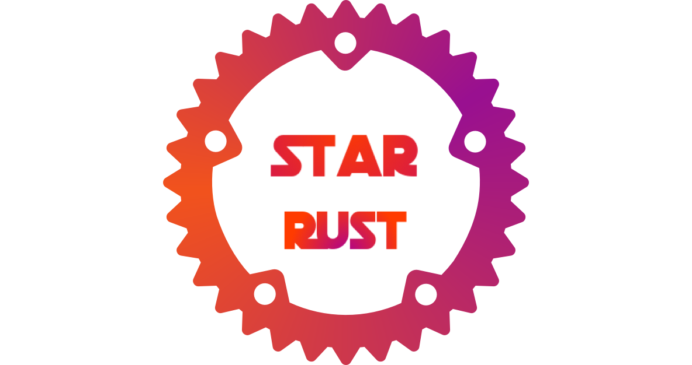

# Star Rust

Inventory of the world’s outstanding Rust open source projects, which are different from [awesome-rust](https://awesome-rust.com/).

**Project inclusion criteria:**

1. Active maintenance
2. There are many stars
3. Active issues and PR
4. Sound documentation examples
5. Does not contain or contains Unsafe Rust that has been safely abstracted
6. Not limited to GitHub repositories

[中文介绍](README_CN.md)

## Table of contents
