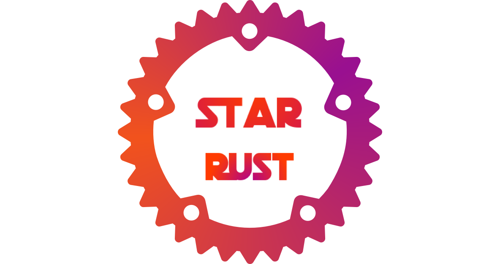

# 星锈： Rust 明星项目汇总

[English introduction](README.md)

盘点国内外优秀的 Rust 开源项目，和 [awesome-rust](https://awesome-rust.com/) 有所不同。

**项目收录标准：**

1. 积极维护
2. star 数目很多
3. 活跃的 issues 和 PR
4. 文档示例健全
5. 不包含或包含已安全抽象的 Unsafe Rust 
6. 不限于 GitHub 仓库

如果你想参与贡献，请阅读[这里](CONTRIBUTING_ZH.md).

## Table of contents

- [数据处理](#data)
    - [数据库（Database）](#database)
    - [可观测数据（Observability）](#observability)
- [游戏引擎](#GameEngine)
    - [数据驱动（Data-Driven） 游戏引擎](#Data-DrivenGameEngine)
    - [3D 游戏引擎](#3DGameEngine)

---

### Database

**tikv/tikv**

TiKV 是一个分布式事务型的键值数据库，提供了满足ACID 约束的分布式事务接口，并且通过Raft 协议 保证了多副本数据一致性以及高可用。

- [Repo](https://github.com/tikv/tikv)
- [了解更多](zh/Data/tikv.md)

### Observability

**timberio/vector**

高性能，高可靠性的可观察性数据管道。

- [Repo](https://github.com/timberio/vector)
- [了解更多](zh/Data/vector.md)

### Data-DrivenGameEngine

**bevyengine/bevy**

A refreshingly simple data-driven game engine built in Rust.

- [Repo](https://github.com/bevyengine/bevy)
- [Learn More](en/GameEngine/bevy.md)

### 3DGameEngine

**mrDIMAS/rg3d**

3d game engine written in Rust.

- [Repo](https://github.com/mrDIMAS/rg3d)
- [Learn More](en/GameEngine/rg3d.md)